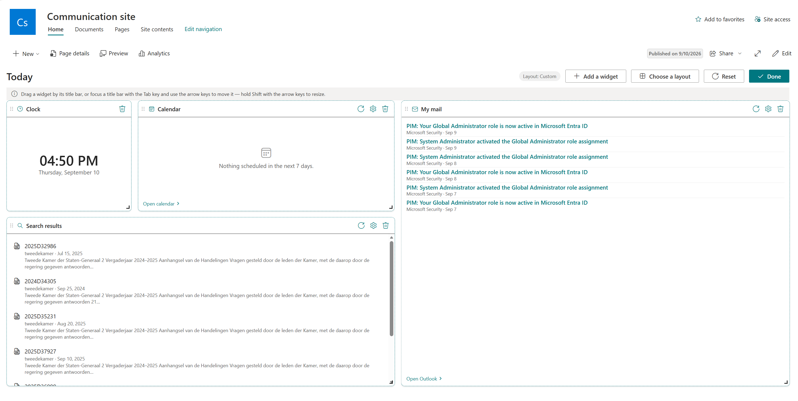
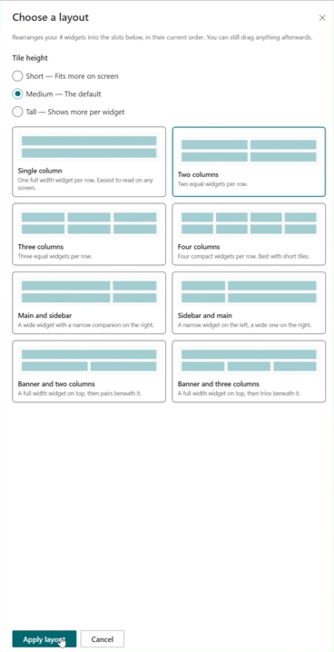
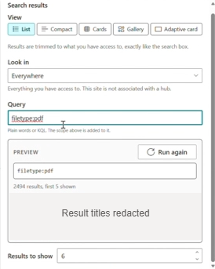

# Today intranet

A SharePoint Framework (SPFx) dashboard that runs as a full-width SharePoint web part, a Microsoft
Teams personal app, or a Teams channel tab. Visitors switch the dashboard into **edit mode from the
app itself** — no SPFx page editing or property pane required — to add, move, resize and remove
widgets. Each person's arrangement is saved for them personally.

Built on SPFx **1.23.2** with the Heft toolchain (gulp is no longer used), React 17 and Fluent UI v8.

**See it in action:** [`docs/intranettoday_medium.mp4`](docs/intranettoday_medium.mp4) demonstrates
widget views, settings, and layout editing. Click the screenshot below to open the recording.

[](docs/intranettoday_medium.mp4)

The recording and its extracted screenshots show an earlier build. The current shared styling is
described under [Visual style](#visual-style).

**Presentation:** open [`docs/presentation/index.html`](docs/presentation/index.html) in a browser
for a product tour, technical architecture, and a custom-widget walkthrough. The deck uses local
HTML, CSS, JavaScript and current UI screenshots; no server or install is needed. Use arrow keys
to navigate, **N** for speaker notes and sources, **O** for the slide overview, or **Print / PDF**
to export all slides. Keep the presentation folder together when sharing; repository source links
require the surrounding checkout.

## Getting started

```bash
npm install
npm start                 # heft start --clean, opens the hosted workbench
npm run build             # heft test --production && heft package-solution --production
```

The hosted workbench target lives in `config/serve.json`. First run on a machine also needs the dev
certificate:

```bash
npx heft trust-dev-cert
```

Useful Heft actions (old gulp equivalents in brackets): `build` [build + bundle], `start` [serve],
`package-solution` [package-solution], `clean` [clean], `dev-deploy` (new — pushes built assets to a
test CDN), `trust-dev-cert`, `untrust-dev-cert`. `--production` replaces the old `--ship`.

The production package is written to `sharepoint/solution/todayintranet.sppkg`. Deploy it to the
**tenant** app catalog. `skipFeatureDeployment` is on, so the web part is available on every site
once the package is approved. Approve the Graph permission requests afterwards (see
[Widgets](#widgets)).

### Microsoft Teams

The component manifest exposes the dashboard as both a `TeamsPersonalApp` and a `TeamsTab`. The
`teams` folder contains the required 192×192 color icon and 32×32 outline icon, named after the web
part component id. SharePoint uses those files and the component manifest to generate the Teams app
package automatically.

To publish both Teams experiences:

1. Run `npm run build` and upload `sharepoint/solution/todayintranet.sppkg` to the **SharePoint
   tenant app catalog**. A site collection app catalog cannot publish the generated app to Teams.
2. Select the package in the tenant app catalog and choose **Add to Teams**. In older app catalog
   experiences this action is named **Sync to Teams**.
3. In Teams, open **Apps > Built for your org**, find **Today intranet**, and add it to the personal
   app rail.
4. To use it in a team, open a channel, select **+** to add a tab, choose **Today intranet**, and
   save the tab configuration.

Teams can take several minutes to refresh its organization app catalog. If synchronization reports
that the app already exists, remove the previous **Today intranet** package from the Teams admin
center and run **Add to Teams** again. Graph-backed widgets still require the API approvals described
under [Widgets](#widgets).

Personal apps do not expose the SPFx property pane. Dashboard arrangement and widget settings remain
available because they are edited inside the dashboard. The personal app stores layouts in the
SharePoint web that hosts the generated Teams app; a channel tab stores them in that team's
SharePoint web. Layouts therefore remain personal but are scoped to the relevant SharePoint web and
dashboard id.

## How the dashboard fits together

```
TodayIntranetWebPart.ts           creates the layout store, captures the theme, renders <Dashboard>
components/Dashboard.tsx          grid, edit mode, add/remove, keyboard nudging, local checkpoints and Done publishing
components/WidgetFrame.tsx        tile chrome: heading, experience link, content surface, drag handle, refresh, settings
components/WidgetErrorBoundary.tsx contains a crashing widget
components/AddWidgetPanel.tsx     widget catalogue: search, categories, permission hints
components/LayoutPresetPanel.tsx  layout picker: column presets and tile height
widgets/IWidget.ts                the widget contract
widgets/WidgetRegistry.tsx        every widget the catalogue offers
widgets/content/                  how widgets describe what they show (see below)
widgets/data/WidgetDataCache.ts   bounded in-memory TTL cache and in-flight request deduplication
widgets/graph/useGraphData.ts     cached Graph query hook with consent-aware error handling
widgets/search/                   cached SharePoint search service, hook and query builder UI
model/IDashboardLayout.ts         persisted layout shape
model/LayoutPresets.ts            layout presets and the code that pours widgets into them
services/*LayoutStore.ts          persistence
```

Layout is authored on a 12 column grid (`react-grid-layout`). Narrower breakpoints are derived from
that canonical layout by clamping widths, and rearranging is only saved at the widest breakpoint so a
phone visit can never scramble someone's desktop layout.

The web part sets `supportsFullBleed: true`, so place it in a **full-width section** on a
communication-site page to get edge-to-edge rendering.

### Rearranging

In edit mode a widget can be dragged by its title bar, or moved from the keyboard: Tab to a title
bar, then arrow keys to move and Shift+arrows to resize. Because the grid compacts vertically, a
vertical nudge swaps the tile with whatever sits above or below it rather than leaving a gap.

### Layouts



*Frame at 00:44: choosing a two-column layout with medium-height tiles.*

**Choose a layout** in edit mode opens a picker with two choices that together define the grid:

| Columns | Tile height |
| --- | --- |
| Single column, Two columns, Three columns, Four columns | Short (4 rows) |
| Main and sidebar, Sidebar and main | Medium (6 rows) |
| Banner and two columns, Banner and three columns | Tall (9 rows) |

Applying a layout pours the widgets already on the dashboard into its slots, in their current order —
it never adds or removes anything. The chosen preset stays in force: adding or removing a widget
reflows into the same slots. Dragging or nudging a tile by hand switches the layout to **Custom**,
shown in the edit toolbar, and nothing reflows again until a preset is applied.

Presets are declared in `model/LayoutPresets.ts` as the column spans of one repeating band, so a new
one is a single entry in `LAYOUT_PRESETS`. Two rules keep a preset stable against the grid's vertical
compaction, which would otherwise pull tiles out of the arrangement the user picked: every tile in a
band gets the band's height, and a band cut short by an oversized widget stretches its last tile to
close the gap. Preset and row-size ids are persisted, so never rename one that has shipped.

## How a widget describes what it shows

Widgets do not style themselves. They describe their content with the shapes in
`widgets/content` and hand it to a shared primitive, which is what keeps a calendar tile, a mail
tile and anything added later looking like one product instead of five.

```
widgets/content/IWidgetContent.ts  the vocabulary: tones, list items, badges, errors, data state, views
widgets/content/WidgetView.tsx     one data state -> skeleton, error, empty state or content
widgets/content/WidgetItems.tsx    draws a collection in whichever view the tile is set to
widgets/content/WidgetList.tsx     the list view, comfortable or compact
widgets/content/WidgetCards.tsx    the cards and gallery views
widgets/content/WidgetCollections.tsx  shared agenda and shortcut-tile views
widgets/content/WidgetCollectionControls.tsx  date navigation, search and pagination
widgets/content/WidgetAdaptiveCard.tsx  the Adaptive Card renderer, themed from the site
widgets/content/toAdaptiveCard.ts  turns ordinary widget items into an Adaptive Card payload
widgets/content/WidgetStat.tsx     a single headline figure
widgets/content/WidgetProse.tsx    heading plus body text
widgets/content/WidgetStates.tsx   the skeleton, empty and error presentations
widgets/content/WidgetSettings.tsx typed fields for the settings flyout, and the view picker
```

A data-driven widget is then a query plus a mapping:

```tsx
const state = useGraphData<Message[]>(context, 'Mail.ReadBasic', fetchMessages, [maxItems]);
const view = viewSetting(context, MAIL_DEFAULT_VIEW);

return (
  <WidgetView
    state={state}
    loading={{ label: 'Loading your inbox…', rows: 4 }}
    empty={{ iconName: 'Mail', text: 'Your inbox is empty.' }}
  >
    {(messages) => <WidgetItems items={messages.map(toItem)} view={view} />}
  </WidgetView>
);
```

`WidgetView` owns the four states every asynchronous tile has, so no widget re-implements them:

| State | What the user sees |
| --- | --- |
| Loading | A skeleton shaped like the rows that are coming, not a spinner |
| Refreshing | The data it already had, with a progress bar — a refresh never blanks a tile |
| Empty | An icon, a sentence and an optional way out ("Open Outlook") |
| Error | A message bar, with **Try again** unless an administrator has to act first |

### Widget data caching

Graph and SharePoint Search responses use one module-level, in-memory cache shared by every instance
of this web part on the page. Identical requests share the same in-flight promise, so duplicate tiles
produce one network request. Successful empty responses are cached too. Cache keys include tenant,
user, site, web, data source, and normalized request parameters, so data cannot cross identities or
settings.

Freshness is deliberately short and source-specific:

| Data | Fresh for |
| --- | --- |
| Mail | 3 minutes |
| Calendar | 5 minutes |
| Tasks | 10 minutes |
| SharePoint Search and news | 15 minutes |

Expired entries are re-read. If that re-read fails because of a recognized transient throttling or
service error, the tile continues to show its last cached result for at most 30 minutes beyond the
freshness window. A compact, timestamped notice says that refresh failed; a failed refresh never
extends the entry's lifetime. Authorization, consent, invalid query, malformed response, and unknown
failures invalidate that request's entry and are surfaced normally. The tile refresh button,
**Try again**, and the Search settings preview's **Run again** action bypass a fresh entry, while
simultaneous refreshes remain deduplicated.

The cache is memory-only: it survives component remounts and SharePoint client-side navigation while
the bundle remains loaded, but not a full page refresh or browser restart. It is capped at 100
completed entries, enforcing that limit as concurrent responses arrive, and prunes entries beyond
their stale fallback window. No mail, calendar, task, or security-trimmed search response is written
to `localStorage` or `sessionStorage`.

`IWidgetListItem` carries a **tone** (`neutral`, `accent`, `success`, `warning`, `danger`) rather
than a colour, so emphasis means the same thing on every tile: a meeting in progress, an overdue
task and an unread message all lean on the same five tones and the same badge.

### Views

Because items are described rather than styled, the same data can be drawn several ways. A widget
declares `supportedViews`, the tile gets a **View** picker in its settings flyout, and the choice is
saved per tile — one person's inbox can be a compact list while another's is a gallery.

| View | What it draws |
| --- | --- |
| List | One row per item — icon, title, meta line |
| Compact | The same rows, tightened, so more fits in a short tile |
| Cards | Each item on its own card, with a tone-coloured edge |
| Gallery | Those cards flowed into a responsive grid |
| Adaptive card | The items rendered as a real Adaptive Card, themed from the site |
| Agenda (opt-in) | Leading status tiles, event details and separately labelled action links |
| Link tiles (opt-in) | Rounded shortcut cards with icons, badges and descriptions |

Widgets never choose a view themselves — they read `viewSetting(context, defaultView)` and hand the
items to `WidgetItems`, which does the rest.

`ALL_ITEM_VIEWS` remains the five general-purpose views. A widget explicitly opts into specialized
views in its definition: Calendar offers Agenda plus the five existing views; My links offers Link
tiles plus those same views. Previously saved calendar view choices still work. Status tiles and
action links use the shared `IWidgetListItem.leadingLabel` and `actions` fields, and badges may include
an `iconName`. The standard semantic tones are shared by all renderers.

#### The same items, five ways

Three calendar events mapped onto `IWidgetListItem` — one meeting running right now, one later
today, one tomorrow:

```tsx
const items: IWidgetListItem[] = [
  {
    key: 'AAMkAGI3…',
    title: 'Weekly leadership sync',
    meta: ['Today · 09:30–10:00', 'Microsoft Teams'],
    hasAccentBar: true,
    tone: 'success',
    isEmphasized: true,
    badge: { text: 'Now' },
    href: 'https://outlook.office.com/calendar/item/AAMkAGI3…'
  },
  {
    key: 'AAMkAGI4…',
    title: 'Intranet design review',
    meta: ['Today · 14:00–15:00', 'Room 4.12'],
    hasAccentBar: true,
    tone: 'accent',
    isEmphasized: true,
    href: 'https://outlook.office.com/calendar/item/AAMkAGI4…'
  },
  {
    key: 'AAMkAGI5…',
    title: 'Quarterly all hands',
    meta: ['Tomorrow · All day'],
    hasAccentBar: true,
    tone: 'neutral',
    href: 'https://outlook.office.com/calendar/item/AAMkAGI5…'
  }
];
```

Nothing in there says "blue", "row" or "card". The view decides that, and only that:

```
List                                        Compact
┌──────────────────────────────────────┐    ┌──────────────────────────────────────┐
│ ▌ Weekly leadership sync       Now   │    │ ▌ Weekly leadership sync       Now   │
│ ▌ Today · 09:30–10:00 · Teams        │    │ ▌ Today · 09:30–10:00 · Teams        │
│                                      │    │ ▌ Intranet design review             │
│ ▌ Intranet design review             │    │ ▌ Today · 14:00–15:00 · Room 4.12    │
│ ▌ Today · 14:00–15:00 · Room 4.12    │    │ ▌ Quarterly all hands                │
│                                      │    │ ▌ Tomorrow · All day                 │
│ ▌ Quarterly all hands                │    └──────────────────────────────────────┘
│ ▌ Tomorrow · All day                 │
└──────────────────────────────────────┘

Cards                                       Gallery
┌──────────────────────────────────────┐    ┌───────────────┐ ┌───────────────┐
│ ┌──────────────────────────────────┐ │    │ ▌       Now   │ │ ▌             │
│ │▌                          Now    │ │    │ ▌ Weekly lea… │ │ ▌ Intranet d… │
│ │▌ Weekly leadership sync          │ │    │ ▌ Today · 09… │ │ ▌ Today · 14… │
│ │▌ Today · 09:30–10:00 · Teams     │ │    └───────────────┘ └───────────────┘
│ └──────────────────────────────────┘ │    ┌───────────────┐
│ ┌──────────────────────────────────┐ │    │ ▌             │
│ │▌ Intranet design review          │ │    │ ▌ Quarterly … │
│ │▌ Today · 14:00–15:00 · Room 4.12 │ │    │ ▌ Tomorrow ·… │
│ └──────────────────────────────────┘ │    └───────────────┘
└──────────────────────────────────────┘
```

The **Adaptive card** view runs the same items through `itemsToAdaptiveCard`, which is where the
tones become Adaptive Card colours. The first item above becomes:

```jsonc
{
  "type": "Container",
  "spacing": "None",
  "separator": false,
  "selectAction": {
    "type": "Action.OpenUrl",
    "title": "Weekly leadership sync",
    "url": "https://outlook.office.com/calendar/item/AAMkAGI3…"
  },
  "items": [
    {
      "type": "ColumnSet",
      "spacing": "None",
      "columns": [
        {
          "type": "Column",
          "width": "stretch",
          "verticalContentAlignment": "Center",
          "items": [
            // tone: 'success' + isEmphasized
            { "type": "TextBlock", "text": "Weekly leadership sync",
              "weight": "Bolder", "color": "Good", "wrap": true, "spacing": "None" },
            { "type": "TextBlock", "text": "Today · 09:30–10:00 · Microsoft Teams",
              "size": "Small", "isSubtle": true, "wrap": false, "spacing": "None" }
          ]
        },
        {
          "type": "Column",
          "width": "auto",
          "verticalContentAlignment": "Center",
          "items": [
            { "type": "TextBlock", "text": "Now", "size": "Small", "weight": "Bolder",
              "color": "Good", "wrap": false, "spacing": "None" }
          ]
        }
      ]
    }
  ]
}
```

#### Tones

One tone vocabulary drives all five views, so the same meaning gets the same emphasis everywhere:

| Tone | Where it comes from | In list / cards | In an Adaptive Card |
| --- | --- | --- | --- |
| `neutral` | An event later in the week, a read message | Grey bar and icon | `Default` |
| `accent` | Unread mail, an event today | Theme accent with a darker text foreground | `Accent` |
| `success` | A meeting happening right now | Green | `Good` |
| `warning` | A high-importance task | Amber accent and pale badge, with readable warning text | `Warning` |
| `danger` | An overdue task | Red, plus an "Overdue" badge | `Attention` |

### Adaptive Cards

`WidgetAdaptiveCard` renders any Adaptive Card (schema 1.5 and lower) with the `adaptivecards`
package. Three things are worth knowing:

- **It is lazy loaded.** The renderer is a large dependency, so it is a separate webpack chunk that
  is only fetched when a tile actually shows a card.
- **It is themed.** The host config is built from the current Fluent/SPFx theme, so cards pick up the
  site's colours and fonts, and our tones map onto the Adaptive Card text colours (`accent` →
  `Accent`, `danger` → `Attention`, and so on).
- **Text is plain text.** Markdown processing is explicitly disabled, so a payload can never inject
  HTML — `Action.OpenUrl` opens in a new tab, `Action.Submit` is handed to the widget, and nothing
  else is honoured.

The **Adaptive card** widget in the catalogue renders a payload pasted into its settings, which is
also the reference for a widget that wants to hand over a card instead of items. An announcement
tile, for instance:

```json
{
  "type": "AdaptiveCard",
  "$schema": "http://adaptivecards.io/schemas/adaptive-card.json",
  "version": "1.5",
  "body": [
    { "type": "TextBlock", "text": "Office move: 14 October", "weight": "Bolder", "size": "Medium", "wrap": true },
    { "type": "TextBlock", "text": "Floors 3 and 4 move to the north wing. Pack your desk by Friday.", "wrap": true, "isSubtle": true },
    {
      "type": "FactSet",
      "facts": [
        { "title": "Owner", "value": "Facilities" },
        { "title": "Questions", "value": "#office-move" }
      ]
    }
  ],
  "actions": [
    { "type": "Action.OpenUrl", "title": "Read the plan", "url": "https://contoso.sharepoint.com/sites/facilities/move" }
  ]
}
```

The payload is stored in that tile's settings, so it travels with the person's dashboard rather than
being published to everyone — handy for a personal card, and the reason a widget backed by a list or
an API is the better route for something the whole site should see.

### Tile chrome

`WidgetFrame` wraps every widget and owns everything outside the content:

- **Title** — enter **Edit dashboard**, open a widget's settings, and change **Title**. Every widget
  has this field, including Clock and widgets without other settings. The header and accessible labels
  update as you type, and the local checkpoint keeps the title for that instance. Clear the field to
  restore the widget's default name; whitespace-only titles also use the default.
- **Refresh** — widgets that set `isRefreshable` get a refresh button; pressing it bumps
  `IWidgetContext.refreshToken`, which `useGraphData` treats as a dependency. The frame never has to
  know where the data came from.
- **Quiet actions** — tile buttons fade in on hover or keyboard focus, and stay visible in edit mode
  and on touch screens, so a full dashboard does not read as a wall of icons.
- **Experience link** — a definition's `footerLink` appears at the top right beside the title,
  not in a separate footer. Static and context-resolved links still use the same definition contract;
  the property name is retained for compatibility.
- **Content surface** — content sits on a rounded, borderless card below the heading. Definitions
  can set `contentSurface: 'none'` when shared content already provides its own surfaces (My links).
- Each tile is a labelled region with a heading, so screen reader users can jump between widgets.

Custom titles live in the optional `IWidgetInstance.title` field, separate from widget-owned
`settings`. Renaming one tile does not rename other instances or its catalogue entry. Existing
layouts without a title continue to use the registered name, and changing layouts preserves titles.

### Visual style

The dashboard uses a soft neutral background, with bold headings outside white, rounded content
surfaces. The outer widget has no border, shadow or decorative title icon; catalogue icons remain.
My links exposes its separate search surface and shortcut cards rather than wrapping them in another
white panel. Edit mode retains a dashed outline and drag handle. Theme tokens adapt these treatments
to the site theme, and forced-colors mode restores visible surface borders. A whole widget does not
lift on hover as though it were a link; interactive items and controls keep their hover/focus feedback.

Native surfaces share [a small Sass vocabulary](src/webparts/todayIntranet/styles/_widgetVisuals.scss):

| Element | Shared treatment |
| --- | --- |
| Spacing | 4, 8, 12, and 16px steps; existing grid gaps and saved tile sizes are unchanged |
| Body text | 14px with a 20px line height |
| Widget headings | 20px with a 28px line height, bold, above the content |
| Content surfaces | 16px rounding and padding by default, without outer elevation |
| Secondary metadata | 12px with a 16px line height |
| Tile actions | 32px targets, with space reserved even when the actions are hidden |
| Compact view | Tighter row padding and text gaps, without hiding fields or changing item limits |

The Adaptive Card host uses the same text hierarchy and theme-aware status foregrounds. Tone text,
accent bars, and badge backgrounds are separate: for example, a warning can retain its amber accent
without using low-contrast yellow for small text. Ordinary titles stay neutral; existing unread and
status emphasis remains meaningful.

Use the shared `themed-border` and `focus-ring` mixins when adding a surface. The build's CSS minifier
can strip quoted theme tokens from border shorthands, or lowercase a case-sensitive theme key when
combining longhands. The mixins preserve those tokens in local CSS custom properties until SPFx
resolves them. No global theme override or fixed light-only palette is needed.

Widget settings, the catalogue, layout picker, and search preview use the same visual rules. Wide
settings fit within narrow viewports, Gallery adapts to the tile's available width, and long titles
truncate without overlapping actions. Scrollbars follow the theme. Keyboard focus remains visible,
forced-colors mode uses system indicators, and reduced-motion preferences disable the shared
shimmers, progress animation, action fades, card transitions, and grid transitions.

The [Adaptive Card host tests](src/webparts/todayIntranet/widgets/content/adaptiveCardHostConfig.test.ts)
cover typography, semantic theme colors, and preserved action settings:

```bash
npx heft test --production --test-path-pattern adaptiveCardHostConfig --disable-code-coverage
```

### Search widgets

`widgets/search` is a second data source alongside Graph, and the same
`IWidgetDataState` shape, so search widgets get skeletons, refresh, empty states and errors for free:

```
widgets/search/SearchService.ts       the REST call, row flattening and error mapping
widgets/search/useSearchData.ts       the search equivalent of useGraphData
widgets/search/searchQuery.ts         scopes, and how a query is assembled from them
widgets/search/SearchQuerySetting.tsx scope picker, query box and the live preview
```

A query is assembled from three parts, and the tile shows the result of that assembly:

| Part | Comes from | Example |
| --- | --- | --- |
| Base | The widget, fixed | `PromotedState:2` (news posts) |
| Scope | The **Look in** picker | `SPSiteURL:"https://contoso.sharepoint.com/sites/hr"` |
| Terms | Whatever the user typed | `FileType:docx handbook` |

| Scope | KQL it adds |
| --- | --- |
| This site | `SPWebUrl:"<web url>"` |
| This site collection | `SPSiteURL:"<site url>"` |
| This hub | `DepartmentId:{<hub id>}` — disabled when the site is not in a hub |
| Everywhere | nothing |

**The preview is the point.** Writing KQL blind is the worst part of configuring a search widget, so
the settings flyout shows the effective query and runs it, debounced, as it is edited:

```
Look in   [ This site collection      ▾ ]
Query     [ FileType:aspx               ]

┌─ PREVIEW ─────────────────────────── Run again ─┐
│ SPSiteURL:"https://contoso.sharepoint.com/      │
│ sites/hr" FileType:aspx                         │
│                                                 │
│ 11 results, first 5 shown                       │
│ · Employee handbook — HR                        │
│ · Onboarding checklist — HR                     │
│ · Expenses policy — HR                          │
└─────────────────────────────────────────────────┘
```

The preview runs exactly what the tile will run — including refusing to run when the widget would.
The Search results widget needs terms, so a scope on its own reports that rather than showing a
sample of the site the tile would never display.



*Frame at 00:20: selecting a view and scope, entering KQL, and previewing the query.
Result titles are redacted.*

## Widgets

| Type key | Widget | Graph permission |
| --- | --- | --- |
| `m365.calendar` | My calendar — Today, Tomorrow, Upcoming and custom dates | `Calendars.ReadBasic` |
| `m365.mail` | My mail — inbox, optional unread-only | `Mail.ReadBasic` |
| `m365.tasks` | My tasks — open Microsoft To Do items | `Tasks.Read` |
| `custom.myLinks` | My links — configurable HTTPS shortcuts, search and pagination | — |
| `sp.news` | News — news posts from a site, a hub, or everywhere | — |
| `sp.search` | Search results — any SharePoint search query | — |
| `card.adaptive` | Adaptive card — renders a payload from the tile's settings | — |
| `demo.clock` | Clock | — |
| `demo.welcome` | Welcome greeting (reference implementation) | — |

**News** and **Search results** run on the SharePoint search REST API as the signed in user, so they
need no admin consent and no permission request: results are already trimmed to what that person can
open. See [Search widgets](#search-widgets).

The three Microsoft 365 widgets need tenant admin approval of the `webApiPermissionRequests` in
`config/package-solution.json`, granted in **SharePoint admin center > Advanced > API access** after
the package is deployed. Until that happens each widget shows a message naming the missing
permission rather than failing silently. The `.ReadBasic` scopes are deliberate: SPFx grants
permissions to the tenant-wide SharePoint Online Client Extensibility principal, not to this
solution alone, so the widgets ask only for the metadata they render — never message or event
bodies and attachments.

### Calendar behavior

Agenda is the default presentation; the original List, Compact, Cards, Gallery and Adaptive card
views remain available in the host's settings flyout. Navigation is temporary UI state, not a saved
dashboard change: each visit starts on Today. Existing `calendarRange` / `selectedDate` settings from
the initial implementation are no longer used; saved `days`, `maxItems` and `view` settings remain.

The native date input retains its picker trigger. Today and Tomorrow keep the input and query date
aligned; Upcoming covers the configured number of local calendar days starting today. Query bounds
use local midnight rather than fixed 24-hour offsets, including daylight-saving changes. Graph
responses are requested in UTC and converted to local display time.

The reader follows all result pages for the selected range. Cancelled events are excluded; completed
events are excluded from current/future ranges **before** limiting the visible rows. Selecting a past
date still shows historical appointments. Badges update every 15 seconds and on focus/visibility
changes without a request on every tick. The data refreshes on five-minute boundaries and when the
date range changes; Sync bypasses the current cached result. A same-range refresh keeps the shared
refresh/stale UI, while changing dates never shows the old date's meetings under a new date label.

Join is offered only when an online-meeting URL is available, with an accessible meeting-specific
label even at narrow widths. Details opens the event in Outlook. No Teams Chat or overflow actions
are fabricated when the required destination or action is unavailable.

### Configuring My links

Unconfigured instances show six sample links: Microsoft Learn, Microsoft Support, MDN Web Docs,
GitHub Docs, Stack Overflow and Wikipedia. Their descriptions explicitly identify them as samples,
and none carry VPN badges. These defaults are also shown in the JSON editor, so you can replace
them easily; they are not automatically written to your saved settings. Existing saved links are
unchanged, and a saved empty array (`[]`) still shows setup guidance rather than restoring samples.

In **Edit dashboard > My links settings**, edit the array in **Links (JSON)**. For example (replace
the example address with your real approved destination):

```json
[
  {
    "title": "Learning Hub",
    "url": "https://intranet.example.org/learning",
    "description": "Access your organization's training.",
    "iconName": "Education",
    "badge": "VPN",
    "tone": "accent"
  }
]
```

`title` and an absolute HTTPS `url` are required. URLs containing embedded credentials are rejected.
`description`, `iconName` (Fluent UI), `badge` and `tone` are optional. Only label a link VPN when your
organization requires it. Supported tones are `neutral`, `accent`, `success`, `warning` and `danger`;
the initial color names (blue, purple, green, orange, red) remain readable and map to semantic tones.
Up to 100 links are supported, with 3–12 links per page (default 9). Invalid JSON or entries show an
explicit error; an empty array restores the setup state. The widget cannot verify that an otherwise
valid HTTPS URL is your organization's correct destination.

Search checks titles, descriptions and badges across all pages and returns to page one when changed.
Search and page selection stay local to each instance. Link configuration, view and page-size settings
use the existing host persistence path, preserving unrelated settings. Existing explicitly saved
destinations are not overwritten; review any links previously copied from the initial sample set.

### Adding a widget

1. Write a component that takes an `IWidgetContext` (instance id, its own `settings`, the SPFx
   `WebPartContext`, `isEditing`, `refreshToken`, and `updateSettings`). Use `useGraphData` for
   anything that calls Microsoft 365 — it handles loading, cancellation, throttling, missing consent
   and the refresh token for you.
2. Describe the content with the primitives in `widgets/content` rather than styling it yourself:
   `WidgetView` for the loading/error/empty/content states, then `WidgetItems` for a collection (it
   handles the five general-purpose views and the opt-in Agenda/Link tiles views), or `WidgetStat`,
   `WidgetProse` or `WidgetAdaptiveCard` for something else. A widget is usually a query plus a `toItem`
   mapping.
3. Register an `IWidgetDefinition` for it in `widgets/WidgetRegistry.tsx` with a **stable** `type`
   key — that key is what lives in saved layouts, so never rename one that has shipped. Give it a
   `category` and `keywords` so it can be found in the catalogue, `requiredPermission` if it needs
   Graph consent, `isRefreshable` if it re-reads on `refreshToken`, `supportedViews` and
   `defaultView` if it renders a collection, and a `footerLink` if there is a full experience to
   link out to. Set `contentSurface: 'none'` only when shared content already provides its own surfaces.
4. Optionally implement `renderSettings`, using the typed fields in `widgets/content` — that is what
   puts a gear icon and settings flyout on the tile.

Widgets are wrapped in an error boundary, so a widget that throws shows a contained message instead
of blanking the dashboard.

## Where layouts are stored

Widget settings, personal titles, placement, and layout presets are saved together as one dashboard
document. For users who can add and edit list items, the primary store is the hidden
**TodayIntranetLayouts** list in the SharePoint **web** hosting the page: `Title` holds
`<dashboard id>|<user login name>` and the plain-text `LayoutJson` note column holds the layout.

The **Dashboard id** is a property-pane setting that defaults to `default`, so out of the box a
person's arrangement is per site and survives the web part being removed, re-added or moved to
another page. Give a second dashboard on the same site its own id to keep the two apart. Changing
the id points everyone at a fresh set of saved layouts — treat it as a deliberate reset. The value is
lower-cased and reduced to `a-z 0-9 . _ -`, max 50 characters, because it ends up in a list item
title, an OData filter and a `localStorage` key.

### Browser-only visitors

**Read-only visitors keep their settings in their browser.** The web part does not grant list or
site permissions to make those settings roam. It checks effective list permissions, not group names,
and displays an informational explanation that settings do not follow the user to other devices.
A returning visitor's scoped local layout takes precedence over an older readable SharePoint copy.
Clearing browser data, changing browser profiles, or using another device does not preserve this
browser-only arrangement.

Local recovery keys include the site ID, web ID, dashboard ID, and user identity. Different sites
on the same origin cannot overwrite each other's settings; pages sharing the same web and dashboard
ID still share an arrangement. Committed edits are checkpointed locally immediately, while cloud
writes happen only after the user selects **Done**. Text drafts are committed on blur or settings
dismissal; Done closes open settings first, checkpoints their final drafts locally, and then requests
one serialized SharePoint publish. Leaving or reloading the page without Done preserves changes in
the scoped browser cache but does not publish them to SharePoint.

A cloud-validated local layout is considered fresh for **five minutes**. Reopening it during that
window uses the scoped browser record without making SharePoint requests. The verified list schema
and effective storage capability are cached for **one hour**; after the layout freshness window,
only the personal layout is re-read while that configuration cache remains valid. When the
configuration cache expires, the list and field metadata are verified again. **Retry** always
bypasses both freshness windows so permission or list repairs take effect immediately.

Successful SharePoint reads and writes refresh the cached layout, item ID, ETag, and validation
times. A remote layout change discovered after the freshness window replaces a clean local cache;
a pending local draft is retained and reconciled instead. These bounded windows intentionally trade
up to five minutes of cross-device freshness for zero SharePoint calls on repeated page loads.

### Provisioning and upgrading an existing list

An owner with Manage Lists rights can provision a missing list by opening the dashboard. The store
verifies the layout field, Title index, hidden/navigation/attachment settings, and own-item access
settings before using the list. Item ownership is based on SharePoint's **Created By** field, not
the login text in Title. Owners and other elevated administrators are not made blind to list items;
hiding a list is not an access-control mechanism.

Title is indexed for scalable lookups but deliberately **does not enforce unique values**. SharePoint
does not allow a unique-value field on a list where users can only view their own items. Do not try
to enable Title uniqueness while `ReadSecurity: 2` is in force.

For an existing list:

1. Back it up with approved SharePoint administration tooling, retaining the complete
   `LayoutJson`, item IDs, Titles, and author metadata. A personal dashboard export is not a list
   backup, and a truncated spreadsheet view is not sufficient.
2. Check for duplicate Titles. Review and reconcile any duplicates with the affected user; preserve
   all original versions before removing records. Do not recreate everyone's items under an owner's
   identity, because that changes own-item access.
3. In the list settings, ensure `LayoutJson` is a **plain-text multiple-lines** field, Title is indexed,
   and Title has **Enforce unique values disabled**. Do not replace an incompatible existing field
   without preserving its data.
4. Verify item-level permissions: read only items created by the user, and create/edit only the
   user's own items (`ReadSecurity: 2`, `WriteSecurity: 2`). Keep attachments disabled, the list
   hidden, and its Quick Launch entry disabled. Do not add write grants for visitors.
5. Reload the dashboard or use **Retry**. Cloud writes resume only after verification passes.

For a hidden list, an owner can obtain its GUID from the hosting web's
`_api/web/lists/getByTitle('TodayIntranetLayouts')?$select=Id` endpoint, then open the hosting web's
`_layouts/15/listedit.aspx?List={list-guid}` settings page. Follow the site's normal administrative
approval process. Provisioning failures are surfaced, and repeated owner initialization can repair missing compatible
configuration; it never automatically deletes duplicate records. Because SharePoint cannot provide
an atomic unique key with own-item visibility, a simultaneous first save from two devices can create
two records. The post-create lookup detects that race, stops cloud acknowledgement, preserves local
recovery data, and asks for list reconciliation rather than silently choosing or deleting a record.

### Recovery, concurrency, and migration

The dashboard distinguishes **saved to SharePoint**, **saved in this browser only**, **pending
synchronization**, **conflicting versions**, and **unsaved** changes. Local quota/policy failures are
not silently ignored. If SharePoint succeeds but local checkpointing fails, the status explicitly
says that cloud storage succeeded while browser recovery is unavailable.

Cloud writes are serialized and use the saved item's ETag rather than an unconditional overwrite.
A stale ETag, competing initial create, or divergent browser draft requires a version choice instead
of silently replacing another edit. Browser snapshots preserve concurrent drafts, and explicit
recovery decisions archive the versions being replaced. **Export** downloads recovery data for this
dashboard, including preserved versions and available unsaved changes; treat the file as personal
data, especially when widgets contain custom payloads. If browser reads are blocked, recovery can
still export available in-memory data; both the status and downloaded JSON explicitly identify that
partial export and explain that stored browser backups could not be read.

Temporary network failures and retryable service responses receive at most **three automatic
retries** with exponential backoff and jitter, respecting SharePoint's `Retry-After` header.
Access-denied and configuration failures do not enter a write-retry loop. **Retry** checks capability
and configuration again. Recovery compares the pending draft's server version, not wall-clock
timestamps: it synchronizes only against an unchanged base, or asks the user to choose when the
base is different or unknown. Changing a read-only user's permissions later does not silently
upload their local changes over a different cloud version.

Existing version 1 and version 2 layouts remain supported. Invalid or newer, unsupported layouts
are preserved and editing is blocked until recovery; the starter layout never silently overwrites
them. Export a backup before an explicit reset. If the browser cannot store recovery backups, free
space or correct its storage policy before resetting; the web part refuses to discard the original.

Old site-less browser keys are **not imported automatically**, since their originating site cannot
be determined. When a scoped browser record is absent, the dashboard offers an explicit legacy
import with a destination warning. The old key remains untouched. Imported layouts with an unknown
cloud base must be reconciled before upload.

### Validation and rollout

Persistence regression tests use the existing Jest/Heft toolchain. `npm run build` runs tests and
production packaging. Before deployment, validate with an owner, a normal writable user, and a
read-only visitor in a test SharePoint web, including two tabs, two same-origin sites, blocked local
storage, and temporary network failures. Verify real ETags, item permissions, and duplicate-create
detection; mock HTTP tests do not establish tenant behavior.

Back up existing lists before upgrading their schema. Avoid mixed old/new cloud writers during
rollout: older clients still perform unconditional updates. Old browser keys are retained for
migration, but older clients cannot read the new scoped recovery format. Rolling back the package
does not downgrade or delete the new recovery snapshots.

Swapping persistence later is a matter of implementing `ILayoutStore`, including its status
subscription, explicit recovery actions, and disposal contract.
